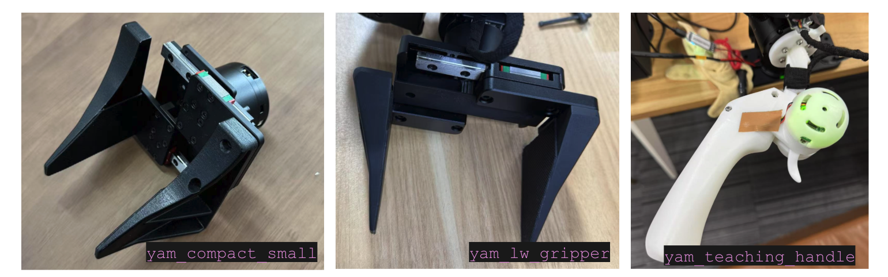

# I2RT Python API

A Python client library for interacting with [I2RT](https://i2rt.com/) products, designed with simplicity and extensibility in mind.

[](https://i2rt.com/)
## Features

- Plug and play python interface for I2RT robots
- Real-time robot control via CAN bus communication
- Support for directly communicating with motor (DM series motors)
- Visualization and gravity compensation using MuJoCo physics engine
- Gripper force control mode and auto calibration

## Installation

```bash
pip install -e .
```

## Basic CAN Usage
Plug in the CAN device and run the following command to check the available CAN devices.
```bash
ls -l /sys/class/net/can*
```

This should give you something like this
```bash
lrwxrwxrwx 1 root root 0 Jul 15 14:35 /sys/class/net/can0 -> ../../devices/platform/soc/your_can_device/can0
```

Where can0 is the CAN device name.

You need to bring up the CAN interface with
```bash
sudo ip link set can0 up type can bitrate 1000000
```

We have provided a convenience script to reset all CAN devices. Simply run
```bash
sh scripts/reset_all_can.sh
```

### See [set_persist_id_socket_can.md](doc/set_persist_id_socket_can.md) if you want to set persistent CAN device names

## Gripper type

Currently YAM supports three different grippers: 


| Gripper Name        | Description |
|---------------------|-------------|
| `yam_compact_small` | Zero-linkage crank gripper, optimized for minimizing gripper width. |
| `yam_lw_gripper`    | Linear gripper with smaller DM3507 motor. Lightweight, but requires calibration or starting with the gripper in the closed configuration. |
| `yam_teaching_handle` | Used for the leader arm setup. Includes a trigger to control the gripper and two customizable buttons that can be mapped to different functions. |

The linear gripper requires an additional calibration step because its motor must rotate more than 2π radians to complete the full stroke.

## Test YAM Zero Gravity mode

This enables you to launch the robot in zero gravity mode:
```bash
python i2rt/robots/motor_chain_robot.py --channel can0 --gripper_type $YOUR_GRIPPER_TYPE
```

## YAM Robot Arm Usage
Default timeout is enabled for YAM motors. Please refer to [YAM configuration](#yam-configuration) for more details.
### Getting started
```python
from i2rt.robots.motor_chain_robot import get_yam_robot

# Get a robot instance
robot = get_yam_robot(channel="can0")

# Get the current joint positions
joint_pos = robot.get_joint_pos()

# Command the robot to move to a new joint position
target_pos = np.array([0, 0, 0, 0, 0, 0, 0])

# Command the robot to move to the target position
robot.command_joint_pos(target_pos)
```

### Running the arm and visualizing it
To launch the follower robot run.
```bash
python scripts/minimum_gello.py --mode follower
```

To launch the robot mujoco visualizer run
```bash
python scripts/minimum_gello.py --mode visualizer
```

---

### Running the arm on controlling it leader follower style
This requires one follower arm and one leader arm with the yam_teaching_handle gripper

To launch the follower robot run
```bash
python scripts/minimum_gello.py --gripper $YOUR_FOLLOWER_ARM_GRIPPER --mode follower --can-channel can0 --bilateral_kp 0.2
```

To launch the leader robot run
```bash
python scripts/minimum_gello.py --gripper yam_teaching_handle --mode leader --can-channel can1 --bilateral_kp 0.2
```
#### 🔧 Usage

In this demo, the **top button** on the teaching handle controls the synchronization between the two arms:

- **Press once** → The **follower arm** will gradually sync to the **leader arm** and maintain synchronization.
- **Press again** → Synchronization stops, and the follower arm will no longer track the leader.


Note on --bilateral_kp:
This parameter controls how strongly the leader arm reacts to the follower arm's position deviation.
A higher value (e.g. > 0.2) will make the leader arm feel heavier and more resistant.
We recommend starting with a value between 0.1 and 0.2.

If you just want to launch the **YAM follower arm** and inspect its output, you can run:
```bash
python scripts/run_yam_leader.py --channel $CAN_CHANNEL
```
example output:
```bash
[-0.33512627  0.00247959  0.00820172 -0.02079042 -0.4110399  -0.07381552]
[PassiveEncoderInfo(id=1294, position=np.float64(0.004382802251101832), velocity=0.0, io_inputs=[0, 0])]
```
This script prints:
- The arm joint angles
- The trigger value on the teaching handle
- The states of the two buttons

---

### [Advanced Users Only]YAM configuration

By default, the arm comes out of the factory with a safety timeout feature enabled. This timeout is set to 400ms, meaning that if the motor does not receive a command within 400ms, it will enter an error state, disable itself, and switch to damping mode. (Contact sales@i2rt.com if you want to disable this feature by default for your bulk order.)

We consider this a safety mechanism—particularly in cases where the CAN connection goes offline. Without this safeguard, gravity compensation under certain configurations could produce positive feedback torque, potentially leading to injury.
However, we understand that this feature may not always be desirable, especially when the arm is intentionally offline. For such cases, we provide a tool to disable the timeout feature.


To remove the timeout feature, run the following command.
```bash
python i2rt/motor_config_tool/remove_timeout.py --channel can0
```

To set the timeout feature, run the following command.
```bash
python i2rt/motor_config_tool/set_timeout.py --channel can0 --timeout
```

We also provide a tool to zero the motor offsets.
```bash
python i2rt/motor_config_tool/set_zero.py --channel can0 --motor_id 1
```
After moving the timeout, you can initialize the YAM arm with the same following command.
```python
from i2rt.robots.motor_chain_robot import get_yam_robot

# Get a robot instance
robot = get_yam_robot(channel="can0")
```

## Flow Base Usage

### Running the demo
You can control your flow base using a game controller.
To run the joystick demo, run the following command.
```bash
python i2rt/flow_base/flow_base_controller.py
```

### Getting started
```python
from i2rt.flow_base.flow_base_controller import Vehicle

# Get a robot instance
vehicle = Vehicle()
vehicle.start_control()

# move forward slowly for 1 second
start_time = time.time()
while time.time() - start_time < 1:
    user_cmd = (0.1, 0, 0)
    vehicle.set_target_velocity(user_cmd, frame="local")
```

## Contributing
We welcome contributions! Please make a PR.

## License
This project is licensed under the MIT License - see the [LICENSE](LICENSE) file for details.

## Support
- Contact: support@i2rt.com

## Acknowledgments
- [TidyBot++](https://github.com/jimmyyhwu/tidybot2) - Flow base hardware and code is inspired by TidyBot++
- [GELLO](https://github.com/wuphilipp/gello_software) - Robot arm teleop is inspired by GELLO
